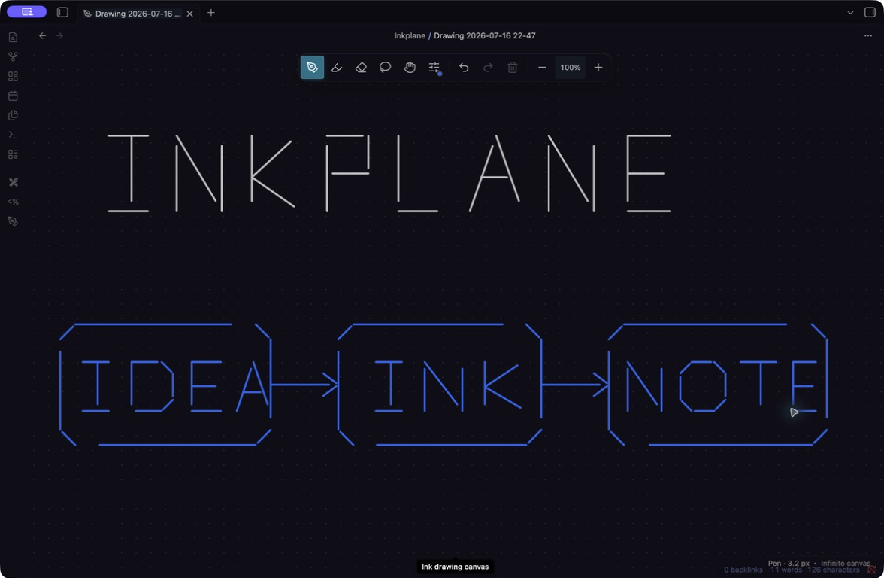
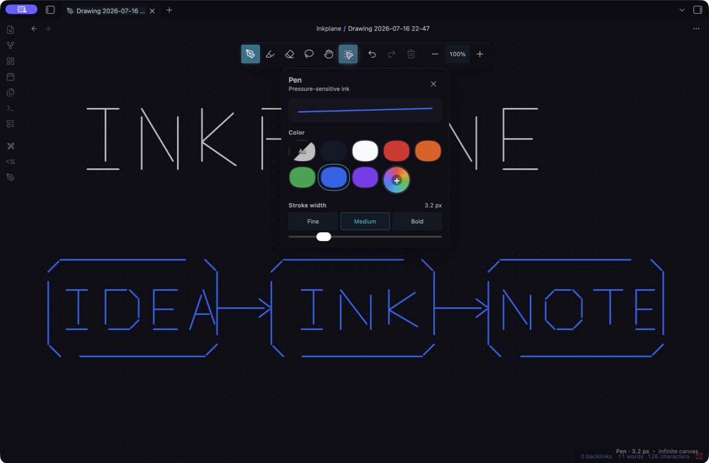

# Inkplane

### A Pencil-first infinite canvas for Obsidian

[](https://obsidian.md)
[](#platform-support)
[](https://github.com/SirwanAfifi/inkplane/releases/latest)
[](LICENSE)

Inkplane gives handwriting and sketches their own dedicated space inside Obsidian. Every drawing is a portable `.inklayer` file in your vault: open it as an edge-to-edge canvas, draw naturally with Apple Pencil or another pen, and embed it in any note when you want it in context.



<p align="center"><sub>A standalone Inkplane canvas in Obsidian, captured from the testing vault.</sub></p>

## Why Inkplane?

- **Made for Pencil input.** Pressure-aware ink, palm rejection, coalesced pointer samples, and iPad-safe controls.
- **A real canvas, not a note overlay.** Draw without being constrained by Markdown layout or page dimensions.
- **Native to your vault.** Drawings are readable JSON files that move, sync, rename, and back up with the rest of your notes.
- **Embed only when useful.** Place a read-only preview in any Markdown note and open the source canvas with one action.
- **Private by default.** No accounts, network requests, analytics, or telemetry.

## Quick start

1. Run **Inkplane: Create new drawing** or select the pen icon in the ribbon.
2. Draw with Apple Pencil. Use one finger to pan and two fingers to zoom on iPad.
3. In a note, run **Inkplane: Insert existing drawing in current note** to add the canvas as an embed.

Inkplane stores new drawings in the `Inkplane` folder by default. Both the folder and default embed dimensions are configurable in **Settings → Inkplane**.

## The canvas

Inkplane keeps the controls compact so the drawing remains the focus:

- Pressure-aware pen and translucent highlighter
- Whole-stroke eraser
- Lasso selection and movement
- Undo and redo history
- Infinite pan and pinch/trackpad zoom
- Stroke-aware fit-to-view
- Theme-matched or fixed ink colours
- Adjustable presets and precise width controls
- SVG export to a normal vault attachment



<p align="center"><sub>The pen palette includes theme-adaptive ink, colour presets, custom colour, width presets, and fine adjustment.</sub></p>

## Embedding drawings

Run **Inkplane: Insert new drawing in current note** to create, embed, and open a canvas in one flow. To reuse a drawing, run **Insert existing drawing in current note**.

Inkplane generates ordinary Obsidian embed syntax:

```md
![[Inkplane/Project sketch.inklayer|800x600]]
```

Change `800x600` to control the preview size. Embedded canvases are intentionally read-only so they never capture note scrolling. Double-click a preview, or use its expand control, to open the source drawing.

## Installation

### BRAT

Until Inkplane is available in the Obsidian Community directory, the easiest installation path is [BRAT](https://github.com/TfTHacker/obsidian42-brat):

1. Install and enable BRAT.
2. Run **BRAT: Add a beta plugin for testing**.
3. Enter `https://github.com/SirwanAfifi/inkplane`.
4. Enable **Inkplane** in **Settings → Community plugins**.

BRAT will keep the plugin updated from GitHub releases.

### Manual installation

1. Download `main.js`, `manifest.json`, and `styles.css` from the [latest release](https://github.com/SirwanAfifi/inkplane/releases/latest).
2. Create `<vault>/.obsidian/plugins/ink-layer/`.
3. Copy the three files into that folder.
4. Reload Obsidian and enable **Inkplane** under **Community plugins**.

The folder remains `ink-layer` for compatibility with existing installations; the product name shown in Obsidian is Inkplane.

## Commands

| Command | What it does |
| --- | --- |
| **Create new drawing** | Creates and opens a standalone canvas. |
| **Insert new drawing in current note** | Creates a drawing, embeds it, and opens it. |
| **Insert existing drawing in current note** | Chooses and embeds a drawing already in the vault. |
| **Export current drawing as SVG** | Writes a scalable image attachment to the vault. |
| **Convert legacy ink from current note to a drawing** | Copies version 0.1 note ink into a standalone canvas. |
| **Select pen / highlighter / eraser / lasso / pan** | Switches tools from the command palette or a custom hotkey. |
| **Undo ink / Redo ink / Fit drawing / Clear drawing** | Controls the active canvas. |

## Platform support

| Platform | Experience |
| --- | --- |
| **iPad + Apple Pencil** | Primary experience: Pencil draws, one finger pans, and two fingers zoom. |
| **Windows pen devices** | Supported through standard browser `PointerEvent` pen input. |
| **Desktop + trackpad** | Draw with a mouse if enabled; pan and zoom with the trackpad or canvas tools. |
| **Touch devices** | Palm rejection is on by default; optional finger drawing is available in settings. |

Inkplane uses web-standard pointer type, pressure, tilt, pointer capture, and coalesced events. Apple Pencil double-tap and Pencil Pro squeeze are not exposed consistently to Obsidian community plugins by the iPad WebView, so Inkplane does not claim to intercept those private hardware gestures.

## Files, migration, and privacy

Each `.inklayer` file is readable JSON. Stroke points are stored as compact tuples containing position, pressure, tilt, and time, while the drawing file retains its canvas metadata. This format follows normal Obsidian Sync, backup, rename, and file-management workflows.

Ink created by Inkplane 0.1 remains untouched in the plugin's `data.json`. Open the original note and run **Convert legacy ink from current note to a drawing** to copy those strokes into a standalone file and insert an embed. The original data is deliberately retained as a backup.

Inkplane makes no network requests and collects no telemetry. The only files it writes are plugin settings, `.inklayer` drawings, and SVG exports you explicitly request.

## Development

Requirements: Node.js, npm, and Obsidian 1.7.2 or newer.

```sh
npm install
npm run check
```

`npm run check` runs the test suite, production build, and release validation. For local development, clone the repository into `<vault>/.obsidian/plugins/ink-layer`, run `npm run dev`, and reload Obsidian when the bundle changes.

A release consists of:

```text
main.js
manifest.json
styles.css
```

The runtime uses Obsidian's mobile-safe APIs and does not import Node.js or Electron APIs. Bug reports and feature requests are welcome in [GitHub Issues](https://github.com/SirwanAfifi/inkplane/issues).

## Compatibility promise

The internal plugin ID remains `ink-layer`, and drawing files retain the `.inklayer` extension. This preserves upgrades, existing installations, embeds, and vault data across the Inkplane rebrand.

## License

[MIT](LICENSE) © Sirwan Afifi
